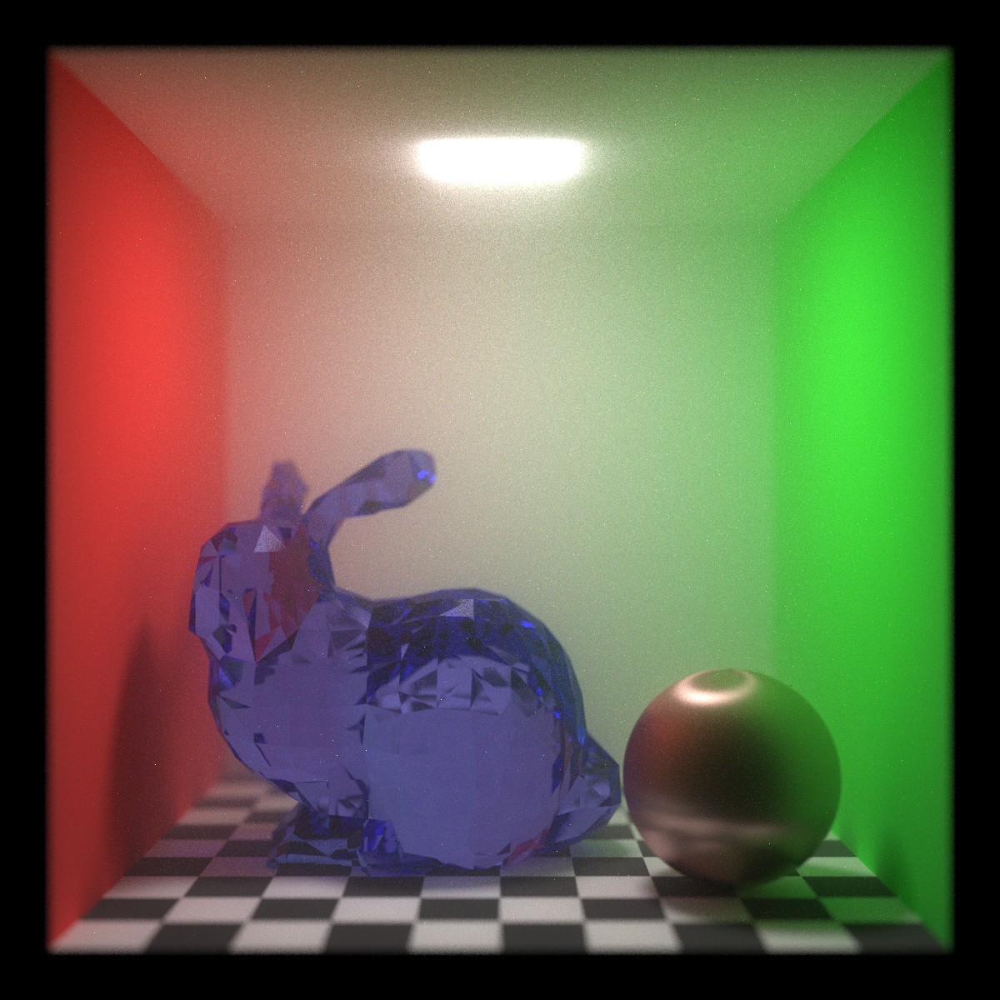

# PetitPt

A tiny pathtracer written in Rust

## Features

- Unidirectional pathtracing
- Ideal diffuse and specular
- Microfacet BRDF/BTDF (GGX)
- NEE (object, IBL)
- BVH
- Depth of field
- Homogeneous medium (no color, no emission)
- Bilateral filter

## Using crates

- bmp: https://github.com/sondrele/rust-bmp
- ply_rs: https://github.com/Fluci/ply-rs
- linked_hash_map: https://github.com/contain-rs/linked-hash-map
- rayon: https://github.com/rayon-rs/rayon
- hdrldr: https://github.com/TechPriest/hdrldr
- num-complex: https://github.com/rust-num/num-complex

## Gallery

Stanford bunny: 

> © Copyright Stanford University – Computer Graphics Laboratory

> [https://graphics.stanford.edu/data/3Dscanrep/](http://graphics.stanford.edu/data/3Dscanrep/)

## References

- Henric Wann Jensen(著), 苗村 健(訳) "フォトンマッピングー実写に迫るコンピュータグラフィックス", 2002, オーム社
- https://rayspace.xyz/CG/
- https://kagamin.net/hole/edubpt/index.htm
- Ingo Wald, Solomon Boulos, and Peter Shirley, Ray tracing deformable scenes using dynamic bounding volume hierarchies
, ACM Transactions on Graphics, Volume 26, Issue 1
- https://qiita.com/omochi64/items/9336f57118ba918f82ec
- Eric Heitz, Unity Technologies, Sampling the GGX Distribution of Visible Normals, Journal of Computer Graphics Techniques
, 2018, Vol. 7, No. 4
- https://sato-gallery.com/education/el/slide_hikari03.pdf
- By Sylvain Paris, Pierre Kornprobst, Jack Tumblin, and Fr' edo Durand, "Bilateral Filtering: Theory and Applications", Foundations and Trends in Computer Graphics and Vision, 2008, Vol. 4, No. 1
