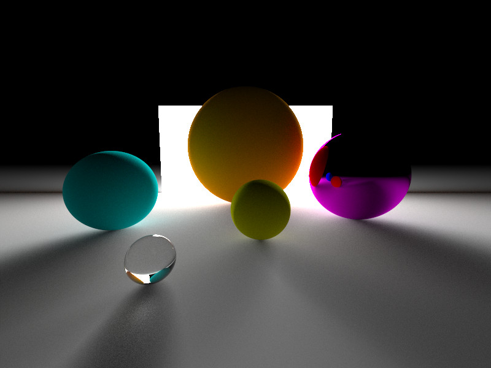
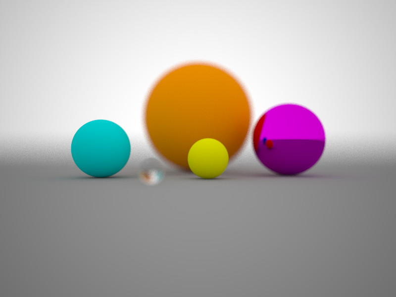
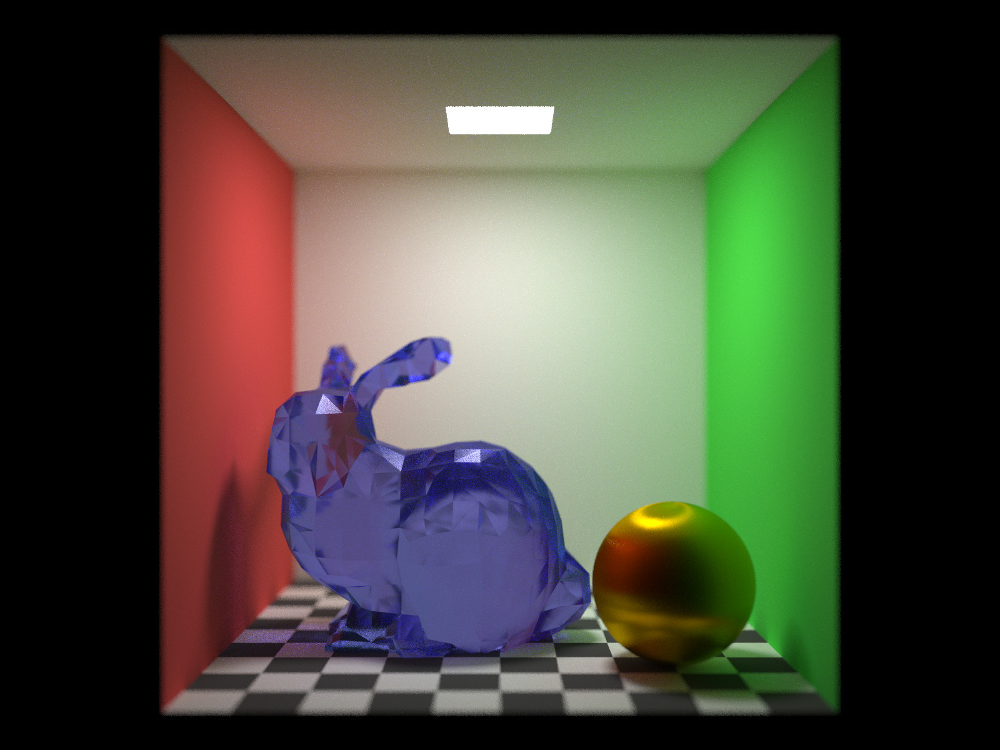

# PetitPt

A tiny pathtracer written in Rust

## Using crates

・bmp: https://github.com/sondrele/rust-bmp

・ply_rs: https://github.com/Fluci/ply-rs

・linked_hash_map: https://github.com/contain-rs/linked-hash-map

・rayon: https://github.com/rayon-rs/rayon

## Gallery

Stanford bunny: 

> © Copyright Stanford University – Computer Graphics Laboratory

> [https://graphics.stanford.edu/data/3Dscanrep/](http://graphics.stanford.edu/data/3Dscanrep/)

## References

・Henric Wann Jensen(著), 苗村 健(訳) "フォトンマッピングー実写に迫るコンピュータグラフィックス", 2002, オーム社

・https://rayspace.xyz/CG/

・https://kagamin.net/hole/edubpt/index.htm

・Ingo Wald, Solomon Boulos, and Peter Shirley, Ray tracing deformable scenes using dynamic bounding volume hierarchies
, ACM Transactions on Graphics, Volume 26, Issue 1
